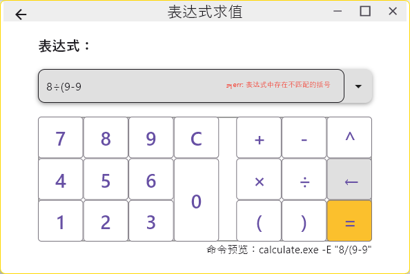

# MECalculator
## Intro

个人制作的第一个Flutter应用，用于给另一个项目MECalculator_console（下简称console）提供更好的UI界面以及输入辅助，项目的主要目的是在项目开发中学习Flutter的使用。

项目主要实现了两个界面，一元稀疏多项式计算输入界面以及表达式求值输入界面。可以从主页进入
> 
>
> 主页

> 
>
> 一元稀疏多项式计算输入界面

> 
>
> 表达式求值输入界面

支持输入预制的输入样例

> 
>
> 多项式输入样例

> 
>
> 表达式输入样例

可以正常显示console的计算结果以及报错

> 
>
> 获取输出结果

> 
>
> 定义域错误

> 
>
> 括号不匹配

## 项目原理
咕咕咕